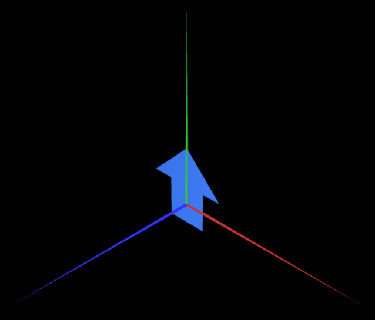
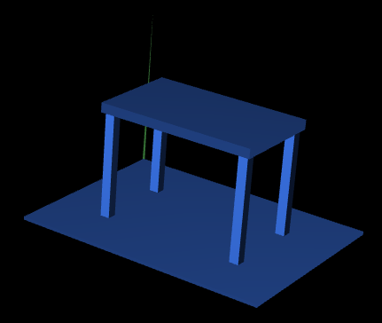
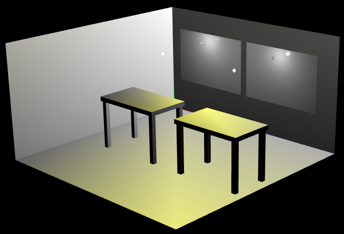
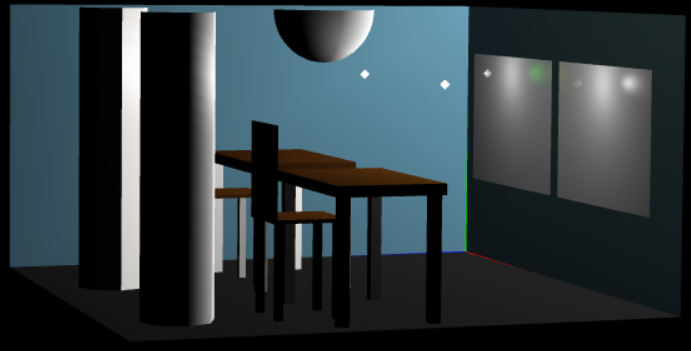
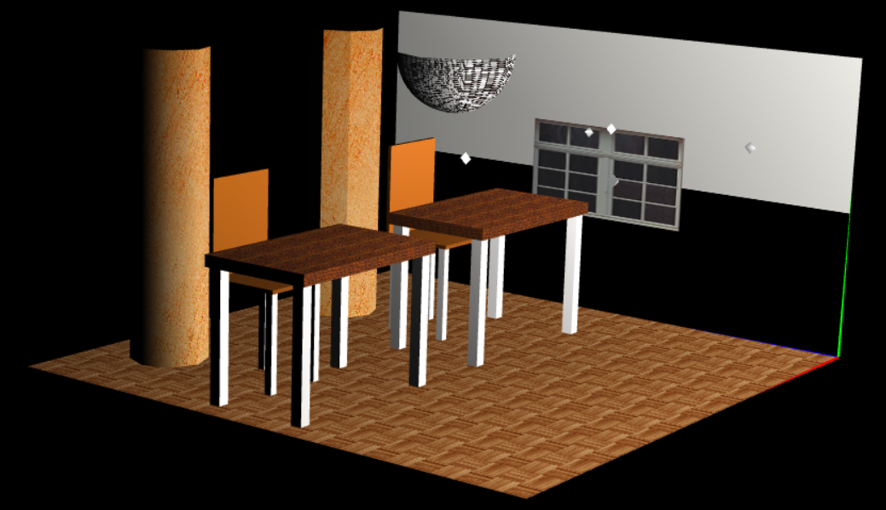
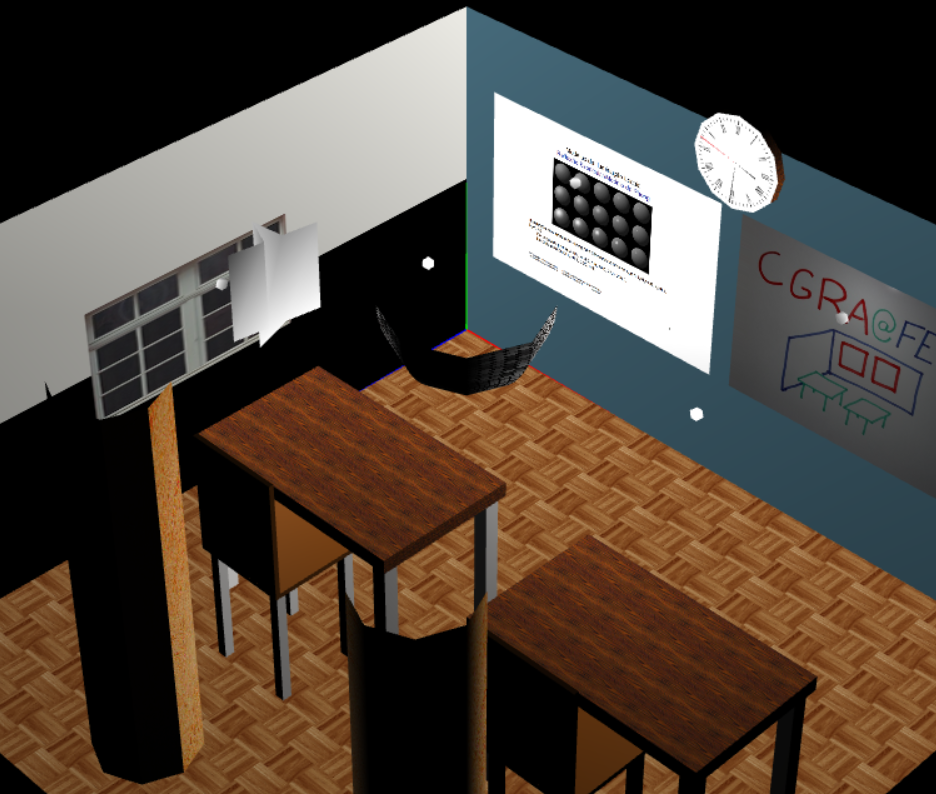
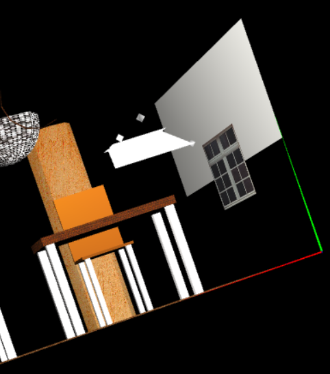
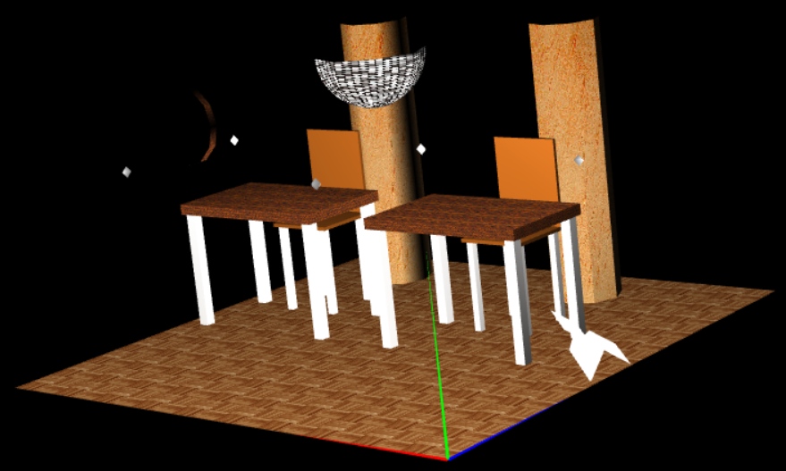
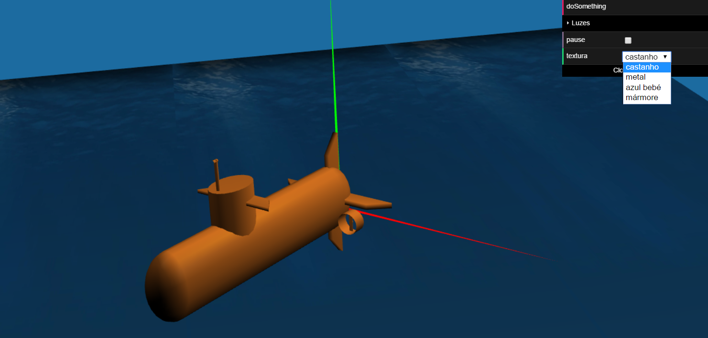
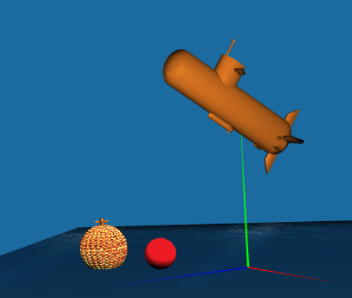

# FEUP_CGRA
Repository for the course "Computação Gráfica" (EIC0019) of the second semester of the second year of MIEIC in FEUP.

In this repository there are the 6 practical assignments (5 "preparation" assignments and 1 final project) of this course in the lective year of 2016/2017.

This is an introductory course to 3D Environments in which an external library is used, called WebCGF developed by a group of teachers from FEUP.

The students are expected to learn the following topics:
  * Local and global ilumination;
  * Visibility calculation;
  * Color representation;
  * 2D and 3D graphc transformations;
  * Modeling of 3D polygonal meshes;
  * Modeling of curves;
  * Modeling of surfaces and solids;
  * Interaction and concepts of GUIs
  * Graphical algorithms such as rasterizing, 2D geomethrical transformations and 2D vizualization algorithms.
  
  The group was proposed a series of 5 practical assignments in which every iteration added some new functionalities and a usually a new element to the existing environment.
  
  The project started out with simple 2D geomethrical shapes:
  
  
  Fig1 - Basic 2D shape.
  
  
  Fig2 - A table.
  
  Quickly evolved to a pleasant scene:
  
  
  Fig3 - A classroom scene.
  
  
  Fig4 - A classroom scene with columns (note that the columns are actually polygons, yet one can be made to look like a cylinder).
  
  
  Fig5 - A classroom scene with textures.
  
  And then an animation was added
    
  
  Fig6 - A falling paper plane.
    
  
  Fig7 - A flying paper plane.
    
  
  Fig8 - A paper plane on the floor.
  
  The final project was a different environment and was expected to have all of the previous elements involved. The resulting scene was a submarine underwater that could move itself with W,A,S,D keys and even shoot torpedos at red targets!
  
  
  Fig9 - Submarine scene.
    
  
  Fig10 - Submarine shooting a target and exploding it.
  
